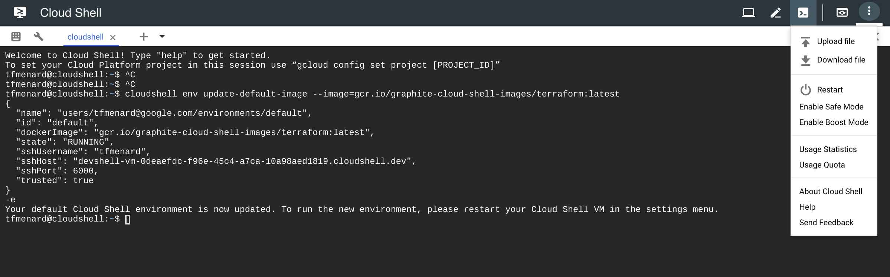
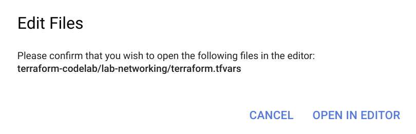
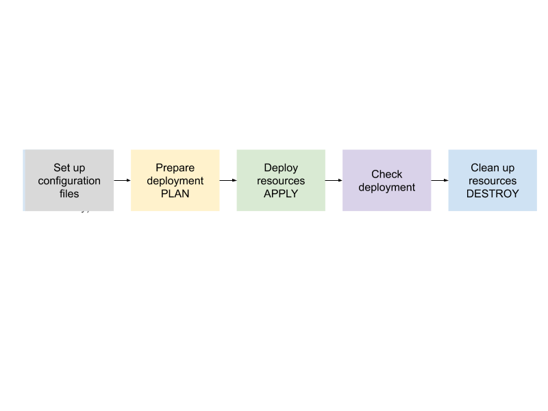

# VPN Networking Lab - Terraform


## **Overview**

This lab introduces to Network and Cloud VPN configuration and deployment using Terraform. You’ll be introduced to Terraform best practices for teams to collaboration and will leverage Cloud Foundation Toolkit to deploy the infrastructure.


### What You’ll Learn

In this Workshop you will learn how to:


*   Use Terraform with a GCS bucket to store the remote state
*   Configure a VPN using Cloud Foundation Toolkit to simulate an OnPrem2GCP connection
*   Deploy a VM using Terraform and verify OnPrem 2 GCP communication


### Objectives

This lab demonstrates the deployment of a network using Terraform. You will learn how to perform the following tasks:


*   Create access credentials for automation in GCP
*   Create a functional environment for using Terraform
*   Create a custom mode Virtual Private Cloud (VPC) network and subnetwork
*   Create a Cloud VPN and connect it with an existing VPN simulating an on-prem environment


## Project Setup

Create 2 projects in GCP and make sure you are owner on both projects.
Name the first project you create **"gcp_project"** and the second project **"onprem_project"**, as this how they'll be referred to in the rest of this tutorial.


## **Task 1. Prepare GCP working environment**

In this section, you:


*   Clone the lab code.
*   Review your gcloud configuration and Cloud Shell environment


### Setting up your environment


1.  Run this command to setup a custom image for Cloud Shell with Terraform pre-installed:

```
cloudshell env update-default-image --image=gcr.io/graphite-cloud-shell-images/terraform@sha256:37b30506de500d806bd911c91e99f151ce2693185527d3eddabc0503758eb4e6
```


2.  Restart Cloud Shell by clicking the kebab menu icon (more options icon) in the top right corner, select “Restart”. Then, click “Restart Cloud Shell”.





3.  Clone the git repo which contains the lab code:

```
git clone https://github.com/Tfmenard/terraform-vpn-lab.git
```


4.  Change the current directory to the repo’s directory:

```
cd terraform-vpn-lab
```


5.  Change the current directory to the networking directory:

```
cd lab-vpn
```


6.  As mentioned above, the first project will be referred as the **gcp_project**, and the second project as the **onprem_project**. Verify that your Cloud Shell is set configured to the **gcp_project**:


```
gcloud config list project
```

**Command output:**
```

[core]
project = <PROJECT_ID>
```


If your project is **not** configured, configure it to match the project ID of the first project from the top, the **gcp_project_id** on the left hand side of this window.


```
gcloud config set project <my_gcp_project_id>
```


**Command output:**
```

Updated property [core/project].
```


7.  The Cloud Shell image comes pre-installed with Terraform. For more details, see the topics [Download Terraform](https://www.terraform.io/downloads.html) and [Install Terraform](https://www.terraform.io/intro/getting-started/install.html).

     \
To verify this, you can run the following command:

```
terraform -v
```


 **Command output**
```
Terraform v0.11.1X
```


## Task 2. Set Variables

In this section, you will set variables for the Terraform configuration. Variables allow you to parameterize Terraform configurations for reuse.

If variables are not set, Terraform will prompt you to set them when it runs.

For ease of use, you can store variable values in a `terraform.tfvars` file which Terraform automatically loads when it runs. This lab comes with an example `terraform.tfvars` file, `terraform.tfvars.example`, which you should edit.


1.  Open the `terraform.tfvars` file in Code Editor:

```
edit terraform.tfvars.example
```


You may get prompted by the following window





If you do, just click “OPEN IN EDITOR”  .


You may also use a CLI code editor like vi if you are more comfortable with it.

2.  Rename the terraform.tfvars.example file to `terraform.tfvars`.

3.  Update the project IDs variables to match your project IDs: 


```
gcp_project_id="<my_gcp_project_id>"
onprem_project_id="<my_onprem_project_id>"
```


## Task 3. Set up GCP access credentials

In this section, you:


*   Create and download service account keys to use as access credentials for GCP.
*   Update your template files to use these access credentials.

Terraform requires access rights to your projects and/or environments in GCP. Although the Terraform [GCP provider](https://www.terraform.io/docs/providers/google/index.html) offers multiple ways to supply credentials, in this lab you create and download a credentials file associated with a GCP service account. Using GCP service-account authentication is a best practice.


### **Create and download default service account access credentials**


1.  Create a Service Account for running Terraform: \


```
gcloud iam service-accounts create terraform
```


**Command Output**
```
Created service account [terraform].
```


2.  List your Service Accounts to get the email for your new Terraform account:


```
gcloud iam service-accounts list
```


**Command Output**
```
NAME  EMAIL
      terraform@<my_gcp_project_id  >.iam.gserviceaccount.com
```


3.  Create and download a key for using the Terraform service account: \


```
gcloud iam service-accounts keys create ../credentials.json --iam-account <service_account_email>
```


**Command Output**
```
created key [...] of type [json] as [./credentials.json] for [terraform@<my_gcp_project_id>.iam.gserviceaccount.com]
```


4.  Grant your Service Account the Owner role on your GCP project:


```
gcloud projects add-iam-policy-binding <my_gcp_project_id> --member=serviceAccount:<service_account_email> --role=roles/owner
```


5.  Grant your Service Account the Owner role on your OnPrem project:


```
gcloud projects add-iam-policy-binding <my_onprem_project_id> --member=serviceAccount:<service_account_email> --role=roles/owner
```


## Task 4. Set up remote state

Terraform stores a mapping between your configuration and created resources in [Terraform state](https://www.terraform.io/docs/state/). By default, this state is stored in a local file but the best practice is to store it remotely on Google Cloud Storage.

In this section, you will:


*   Create a Google Cloud Storage bucket to store Terraform state
*   Update your Terraform configuration to point to this bucket


### **Create and configure a GCS bucket**


1.  Create a new bucket to store Terraform state. A GCS bucket needs to be globally unique, so be sure to prefix its name with your project id as shown in the command below: \


```
gsutil mb gs://<my_gcp_project_id>-state-bucket
```


**Command Output**


```
Creating gs://<my_gcp_project_id>-state-bucket/...
```


2.  Open the backend config stored in `backend.tf`:

```
edit backend.tf
```


3.  Update the bucket name to match your choice and save the file:

```
terraform {
  backend "gcs" {
    bucket = "my-state-bucket"       # Change this to <my_gcp_project_id>-state-bucket
    prefix = "terraform/lab/network"
  }
}
```


## Task 5. Setup the Network and VPN

The repo you downloaded includes a module defining your network and subnets and VPN. You will modify this subnet to be able to communicate with your on-prem environment.


### **Edit Terraform configuration**


1.  Open the network config stored in `network_vpn_gcp.tf`. The network config in this file is managed via the Cloud Foundation Toolkit [Network Module](https://github.com/terraform-google-modules/terraform-google-network) and [VPN Module](https://github.com/terraform-google-modules/terraform-google-vpn)

```
edit network_vpn_gcp.tf
```


2.  This terraform code won’t work as is. You need to add an additional CIDR block in the `subnet_ip` ip variables. You can choose your own name and CIDR range as long as it doesn’t overlap with the OnPrem_CIDR_Block (`10.5.4.0/24`). For example, the CIDR block, `10.1.3.0/24`, will work.


```
# Create the network
module "vpc-gcp" {
  source  = "terraform-google-modules/network/google"
  version = "~> 0.4.0"

  # Give the network a name and project
  project_id   = "${var.gcp_project_id}"
  network_name = "my-custom-network-2"

  subnets = [
    {
      # Creates your first subnet in us-west1 and defines a range for it
      subnet_name   = "my-first-subnet"
      subnet_ip     = "<my_cidr_block>" # Edit this line
      subnet_region = "us-central1"
    }
  ]
  secondary_ranges = {
    my-first-subnet = [{
        range_name    = "my-secondary-range"
        ip_cidr_range = "192.168.64.0/24"
    }]
  }
}

```


3.  You also need to set the Peer ASN to match the ASN of the OnPrem VPN. In the same `network_vpn_gcp.tf` file, set the peer_asn variable to **64516**. You can verify the OnPrem ASN by opening the `network_vpn_onprem.tf `file. This VPN uses a Dynamic Routing to setup a VPN. An example of Static Routing for your own curiosity.

```
 module "vpn-gw-us-ce1-prd-onprem-internal" {
  source  = "terraform-google-modules/vpn/google"
  version = "0.3.0"
  project_id         = "${var.gcp_project_id}"
  network            = "${module.vpc-gcp.network_name}"
  region             = "us-central1"
  gateway_name       = "vpn-gw-us-ce1-prd-onprem-internal"
  tunnel_name_prefix = "vpn-tn-us-ce1-prd-onprem-internal"
  shared_secret      = "secrets"
  tunnel_count       = 1
  peer_ips           = ["${module.vpn-gw-us-ce1-onprem-prd-internal.gateway_ip}"]

  cr_name                  = "cr-uscentral1-to-onprem-vpc-tunnels"
  bgp_cr_session_range     = ["169.254.0.1/30"]
  bgp_remote_session_range = ["169.254.0.2"]
  peer_asn                 = ["<my_peer_ASN>"] # Edit this line
}
```


## Task 6. Run Terraform

Now that you have configured credentials and remote state, you are ready to run Terraform. When using Terraform, you will generally follow these steps to deploy and clean up an environment, as outlined in the following image.





### Run Terraform for the first time


1.  First, initialize Terraform to download the latest version of the Google and Random providers:

```
terraform init
```


*If you run this command and received an error regarding you GCS bucket not existing, make sure you have the correct name in backend.tf. Then, run the commands below:


```
rm -rf /.terraform
terraform init
```


This will clean your local Terraform state and produce a successful initialization. 


2.  Run a plan step to validate the configuration syntax and show a preview of what will be created:

```
terraform plan
```


The plan output shows Terraform is going to create 7 resources for your network.

3.  Now execute Terraform apply to apply those changes:

```
terraform apply
```


You will see output like this:

**Command output**
```
Plan: 28 to add, 0 to change, 0 to destroy.
Do you want to perform these actions?
  Terraform will perform the actions described above.
  Only 'yes' will be accepted to approve.
  Enter a value:
```


Enter "yes" to the prompt. After the apply has finished, you should see an output similar to the following:

```
Apply complete! Resources: 28 added, 0 changed, 0 destroyed.
```


4.  Once you have applied the changes, you can display the list of resources in the Terraform state with the show command:

```
terraform show
```


## Task 7. Restrict source ranges

The lab includes code for managing [firewall rules](https://cloud.google.com/vpc/docs/firewalls) in Terraform. Right now, the network allows traffic from any source, which isn’t particularly secure. We’ll modify the pre-configured firewall rules for our **gcp_project**’s network to only allow traffic coming from our onprem network.


### Edit the source range


1.  Open the firewall config stored in `firewall.tf`.

```
edit firewall.tf
```


2.  Edit the “**onprem”** resource to have its **source_ranges**, variable set to GCP_CIDR Block (`10.1.3.0/24`)

```
resource "google_compute_firewall" "onprem" {
  name    = "onprem-firewall"
  network = "${module.vpc-onprem.network_name}"
  project = "${var.onprem_project_id}"

  allow {
    protocol = "icmp"
  }

  allow {
    protocol = "tcp"
    ports    = ["22"]
  }
  source_ranges = ["0.0.0.0/0"] # Edit this line
}

resource "google_compute_firewall" "gcp" {
  name    = "gcp-firewall"
  network = "${module.vpc-gcp.network_name}"
  project = "${var.gcp_project_id}"

  allow {
    protocol = "icmp"
  }

  allow {
    protocol = "tcp"
    ports    = ["22"]
  }
   source_ranges = ["0.0.0.0/0"] 
}

```


3.  Now execute Terraform apply to update the firewall rule:

```
terraform apply
```


4.  The output of this command will give you you’re subnet’s gateway. Use it to complete the configuration of your pre configured onprem VPN

**Command output**
```
Outputs:

gcp_network_name = my-custom-network-2
gcp_subnet_name = my-first-subnet
onprem_network_name = my-custom-network-1
onprem_subnet_name = my-first-subnet
```


## Task 8. Deploy a VM in the GCP subnetwork

Now, we’d like to deploy a VM in our subnetwork it via Terraform so we can ping a VM that’s in our onprem network. However, it is a best practice to separate Terraform configurations into logical units and VM instances might be an application-layer concern.

So, we will switch to a new application-specific Terraform config and make updates there—leaving our networking Terraform alone.


### Set up application Terraform config


1.  Switch to the application lab directory in your Cloud Shell:

```
cd ../lab-vm
```


2.  Copy `terraform.tfvars `file over from your networking configuration:

```
cp ../lab-vpn/terraform.tfvars .
```


3.  Update the backend configuration for your application Terraform code by editing `backend.tf`:

```
edit backend.tf
```


Note that you can reuse the same GCS bucket and simply have a different **prefix** for the application state. Make sure to update the bucket setting here to match the same bucket you used before:


```
terraform {
  backend "gcs" {
    bucket = "<my_gcp_project_id>-state-bucket"       # Edit this this line to match your lab-networking/backend.tf file 
    prefix = "terraform/lab/vm"
  }
}
```


You should also update the Terraform remote state data source. Terraform remote state is very useful for sharing information/outputs across multiple projects—for example, for a central networking team to share subnet information with application teams.


```
data "terraform_remote_state" "network" {
  backend = "gcs"

  config {
    bucket  = "<my_gcp_project_id>-state-bucket" # Update this too
    prefix  = "terraform/lab/network"
  }
}
```


4.  Open the `vm_gcp.tf` file and notice that we’re able to use a reference to choose the subnet name to deploy on. The `${data.terraform_remote_state.network.gcp_subnet_name}` declaration automatically grabs the `gcp_subnet_name` output from the networking config you created earlier:

```
resource "google_compute_instance" "gcp_vm" {
  ...

  network_interface {
    subnetwork         = "${data.terraform_remote_state.network.gcp_subnet_name}"
    subnetwork_project = "${var.gcp_project_id}"

    access_config {
      # Include this section to give the VM an external ip address
    }
  }

  ...
}
```


5.  Assuming everything looks good in this configuration, you can apply the Terraform to deploy the VM.

```
terraform init
terraform apply
```


This will output the internal IP of your VM.


**Command output**


```
Apply complete! Resources: 2 added, 0 changed, 0 destroyed.

Outputs:

gcp_vm_internal_ip = 10.1.3.2 # Example gcp internal ip
onprem_vm_internal_ip = 10.5.4.2 # Example onprem internal ip
```


## Task 9. Verify the network connectivity


1.  In Cloud Shell, access the newly created VM via SSH:

```
gcloud compute ssh --project <my_gcp_project_id> --zone us-central1-a gcp-server
```


You may get prompted with the following:


```
WARNING: The public SSH key file for gcloud does not exist.
WARNING: The private SSH key file for gcloud does not exist.
WARNING: You do not have an SSH key for gcloud.
WARNING: SSH keygen will be executed to generate a key.
This tool needs to create the directory
[/home/googlece32150_student/.ssh] before being able to generate SSH
keys.

```


Simple enter “Y”, then “Enter” and again “Enter”


1.  To test connectivity to on-prem-1's external IP, run the following command, replacing on-prem-1's external IP with the value noted earlier:

```
ping -c 3 <onprem_vm_internal_ip>
```


If everything is configured correctly you should have the following output

**Command output**
```
3 packets transmitted, 3 received, 0% packet loss, time 1999ms
```


## Task 10. Review

In this lab, you completed the entire workflow for automating the deployment of your networking resources in GCP. You set up access credentials, set up Terraform, created resources including a VPC network, subnet, VPN, and firewall rules, modified the existing resources, carefully verified the capabilities of those resources, and then outputted them.

You also reviewed a pattern for organizing your automation that can be reused. Organizing resources into configuration files of related resources aids comprehension and maintenance of those resources. In these files, the use of variables helps to enable reuse of your configuration blocks in many different environments.

Then you deployed VM instances on the networks you created and verified their connectivity.
